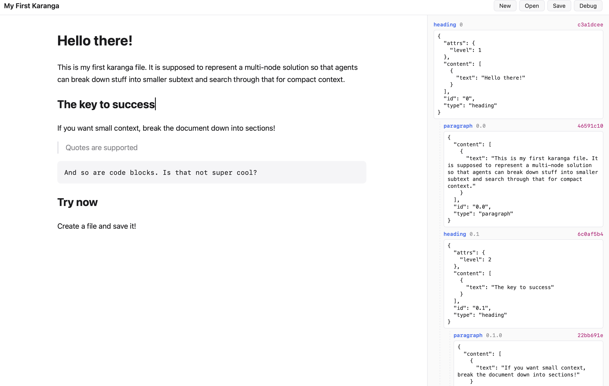

# Karanga

**A document format and editor built for hybrid human/agent collaboration.**



Karanga documents are *atomic on the inside and whole on the outside*. A human reads
and edits a flowing, Word-like document; an agent searches, navigates, and retrieves
the same content one addressable node at a time — without ever loading the whole
document into its context. The format is a single, self-contained, portable file.

> *Karanga* is the name of an Aardvark at the Nashville Zoo, and is the Swahili word for peanut.

---

## The problem

Documents are written for humans to read top-to-bottom, but agents pay a context tax
every time they read one to answer a narrow question. Structured/agent-friendly formats,
in turn, tend to stop being documents a human wants to write in. Karanga refuses the
trade-off: one artifact that is a genuine document for people **and** a queryable graph of
atomic nodes for agents, with neither side leaking into the other.

## Core ideas

### The `.krg` package

A `.krg` file is a **package** (a zip, in the lineage of `.docx` / `.epub` / `.ipynb`) — not a
flat blob. Inside:

```
mydoc.krg
├── manifest.json   # title, description, spec version            (discovery)
├── spine.json      # ordered tree of node-ids → reconstructs the document
├── nodes/          # one part per typed atomic node (random-access)
│   ├── n_01.json   #   heading
│   ├── n_02.json   #   paragraph
│   └── …
├── links.json      # the link graph (intra- and inter-document, by global node-id)
└── media/          # embedded media (self-contained)
```

Because zip entries are independently addressable, a reader can extract **one node**
without parsing the rest of the file.

### The container *is* the index

The three-tier query model falls directly out of the file structure — **no database, no
separate index, no index-freshness problem:**

| Tier | Question | What's read |
|---|---|---|
| 1 | *Which document?* | `manifest.json` only (never the bodies) |
| 2 | *Where in it?* | `spine.json` — the outline |
| 3 | *The content* | one part from `nodes/` |

### Packed vs. exploded

A `.krg` is **packed** (one file) at rest and for sharing, and **exploded** (a working
directory of its parts) while being edited — packed/unpacked at the boundaries, the way
editors handle `.docx` internally. Live editing, indexing, and multi-client coordination
operate on the exploded form.

## Design principles

Karanga is bound by six hard constraints. Every part of the system is checked against them:

1. **Atomic.** Content is decoupled and linked; an agent retrieves a node, not a document.
2. **Reconstructable.** The same data renders as a traditional, editable document.
3. **Tiered query.** Document → document index → node.
4. **Multimedia.** Media is supported; the client renders it.
5. **No leakage.** The human never sees the structure; the agent may.
6. **Lightweight, portable, encapsulated.** One self-contained file. No server required.

## Architecture

A single Rust core implements the format; every surface is a thin layer over it.

```
                         karanga-spec  (the .krg contract + conformance suite)
                               ▲ implements
                          ┌────┴─────┐
                          │ krg-core │   reader / writer / query engine
                          └────┬─────┘
        ┌──────────────┬───────┼────────────┬─────────────────────┐
     krg-cli        krg-mcp        krg-convert            editor (Tauri)
   (`krg …`)     (agent verbs)   (md/docx ⇄ krg)     (human WYSIWYG client)
```

- **`krg-core`** — open/reconstruct/render, the query tiers, write + repack, validation.
- **`krg-cli`** — `krg search`, `krg outline`, `krg get`, `krg render`, `krg links`.
- **`krg-mcp`** — exposes the query/edit verbs to agents over MCP.
- **`krg-convert`** — interop with Markdown and other formats.
- **editor** — cross-platform desktop app; renders the spine as a flowing document.

The format itself imposes no concurrency control — like `.docx`, a `.krg` is passive data.
Concurrent human + agent editing is coordinated by the writer library using **optimistic,
node-level compare-and-swap**: independent nodes never collide, and a same-node clash is
surfaced as a "re-read" rather than clobbering. No lock server, no daemon — the only lock is
a brief advisory guard while repacking the zip.

## Status

Early design. The specification and reference implementation are being built in the open.
Interfaces and the on-disk format are **not yet stable**.

## License

[MIT](LICENSE) © 2026 Cameron G. Gould
